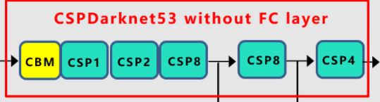
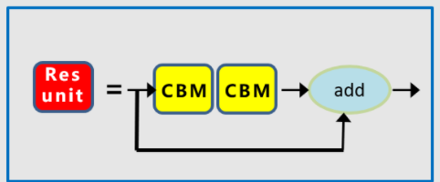
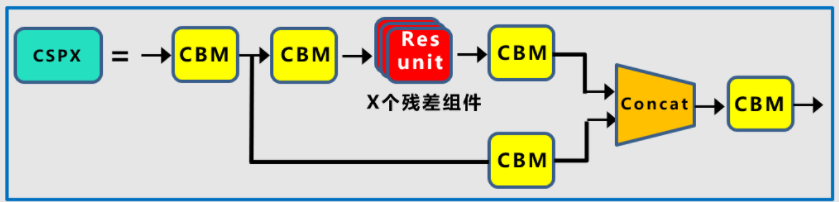
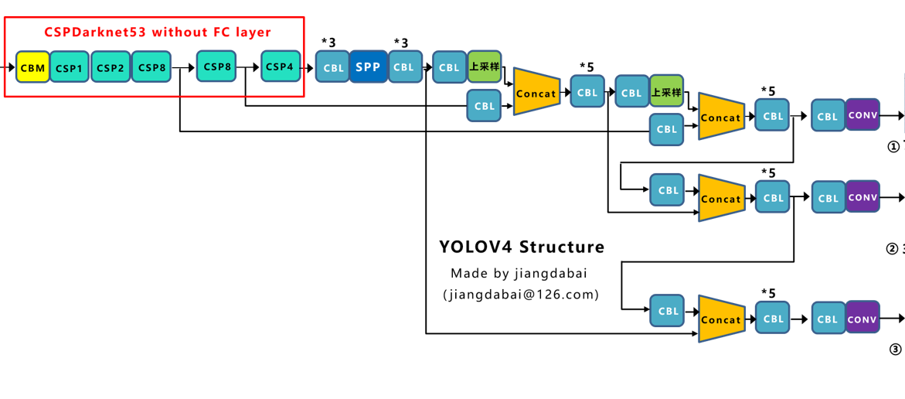
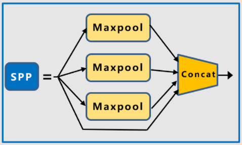
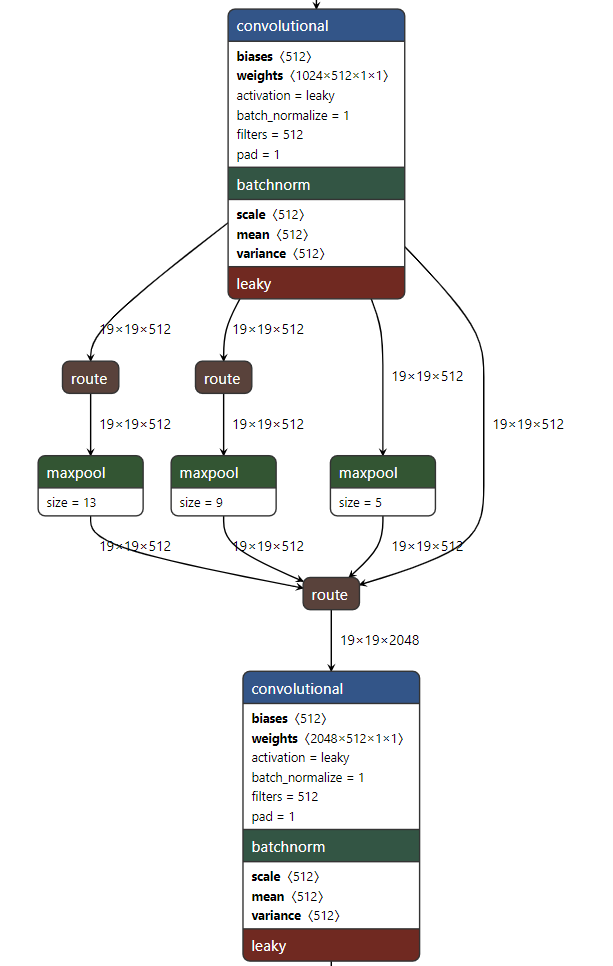
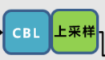
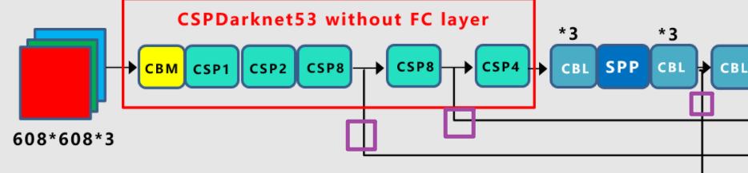
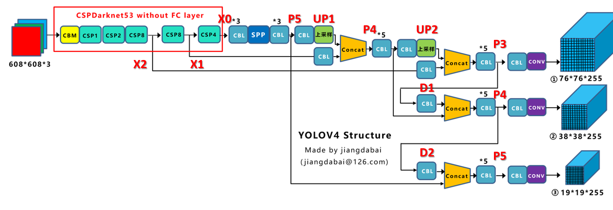

# 用Pytorch从零复现YOLOv4网络主体部分 手撕代码#2

## Ⅰ.实现目标

YOLO算法是目标检测算法中的经典算法，在two-stage目标检测领域独占鳌头。而YOLO算法的核心思想也是各大厂面试的考核点之一，理解从一代YOLO到第五代YOLO的技术演变对读者亦有颇大帮助。

此处复现的是YOLOv4，从零仅借助pytorch相关接口复现网络主体部分（不涉及训练部分）。适合读者练手提高代码能力。

[TOC]

*参考资料：

https://edu.51cto.com/course/25481.html（主要代码来源）

[江大白讲解YOLO系列博文](https://blog.csdn.net/nan355655600/article/details/106246625?ops_request_misc=%257B%2522request%255Fid%2522%253A%2522164560863416780357243676%2522%252C%2522scm%2522%253A%252220140713.130102334..%2522%257D&request_id=164560863416780357243676&biz_id=0&utm_medium=distribute.pc_search_result.none-task-blog-2~all~top_positive~default-1-106246625.142^v1^control&utm_term=yolov4&spm=1018.2226.3001.4187)（主要图片来源）

------


## Ⅱ.开始代码寿司🍣

首先对整个模型有个大概的认知，此处借用[江大白](https://blog.csdn.net/nan355655600/article/details/106246625?ops_request_misc=%257B%2522request%255Fid%2522%253A%2522164560863416780357243676%2522%252C%2522scm%2522%253A%252220140713.130102334..%2522%257D&request_id=164560863416780357243676&biz_id=0&utm_medium=distribute.pc_search_result.none-task-blog-2~all~top_positive~default-1-106246625.142^v1^control&utm_term=yolov4&spm=1018.2226.3001.4187)的网络结构图。


### 一、CSPDarknet53实现

具体而言就是Backbone前面的一部分。



#### ①Mish激活函数

很简单，根据公式写即可。

> Mish = x*tanh(ln(1+e^x))

```python
class Mish(nn.Module):
    '''
    MISH activation function
    '''
    def __init__(self):
        super().__init__()
        
    def forward(self, x):
        return x * torch.tanh(F.softplus(x))
```


#### ②CBM


具体而言就是Conv + BN + Mish。

```python
class CBM(nn.Module):
    '''
    CBM
    CONV + BATCHNORM + MISH
    '''
    def __init__(self, in_channels, out_channels, kernel_size, stride=1):
        super().__init__()
        
        self.conv = nn.Conv2d(in_channels, out_channels, kernel_size, stride, kernel_size//2, bias=False)
        self.bn = nn.BatchNorm2d(out_channels)
        self.activation = Mish()
        
    def forward(self, x):
        x = self.conv(x)
        x = self.bn(x)
        x = self.activation(x)
        return x
```

#### ③ResBlock



仔细看模型会发现部分resblock会存在hidden_channels，故引入此参数，无hidden_channels的默认其值为channels，即无中间隐藏通道变换。

```python
class Resblock(nn.Module):
    '''
    Resblock
    CBM + CBM + SKIP CONNET
    '''
    def __init__(self, channels, hidden_channels=None):
        super().__init__()
        
        if hidden_channels is None:
            hidden_channels = channels
            
        self.block = nn.Sequential(
            CBM(channels, hidden_channels, 1),
            CBM(hidden_channels, channels, 3),
        )
        
    def forward(self, x):
        return x + self.block(x)
```

#### ④CSPX模块



现在知道为何CSPX模块要放到最后来实现了吧，就是因为CSPX模块是在CBM和Resblock的基础上拼接构建的。

我们再回到yolov4的Darknet看看，其中CSP1表示其中包含一个红色的残差组件，CSP2则表示含有两个，以此类推。很明显，我们要将其设为参数传入，并按照1，2，8，8，4的顺序将其连接起来。


```python
class CSPX(nn.Module):
    def __init__(self, in_channels, out_channels, num_blocks, first):
        super().__init__()
        
        self.downsample_conv = CBM(in_channels, out_channels, 3, stride=2)

        if first:
            self.split_conv0 = CBM(out_channels, out_channels, 1)
            self.split_conv1 = CBM(out_channels, out_channels, 1)
            self.blocks_conv = nn.Sequential(
                Resblock(channels=out_channels, hidden_channels=out_channels//2),
                CBM(out_channels, out_channels, 1)
            )
            self.concat_conv = CBM(out_channels*2, out_channels, 1)
        else:
            self.split_conv0 = CBM(out_channels, out_channels//2, 1)
            self.split_conv1 = CBM(out_channels, out_channels//2, 1)
            self.blocks_conv = nn.Sequential(
                *[Resblock(channels=out_channels//2) for _ in range(num_blocks)],
                CBM(out_channels//2, out_channels//2, 1)
            )
            self.concat_conv = CBM(out_channels, out_channels, 1)
            
    def forward(self, x):
        x = self.downsample_conv(x)
        x0 = self.split_conv0(x)
        x1 = self.split_conv1(x)
        x1 = self.blocks_conv(x1)
        
        x = torch.cat([x1, x0], dim=1)
        x = self.concat_conv(x)
        
        return x
```

#### ⑤组合起来！


我们再看一眼结构图，是很简单的线性模型，将我们之前创建好的CBM以及CSPX模块串起来即可。特别注意最后forward需要返回三个输出，分别是第一个CSP8，第二个CSP8以及最后一个CSP4后的输出。

```python
class CSPDarknet(nn.Module):
    def __init__(self, layers):
        super().__init__()
        self.inplanes = 32
        self.conv1 = CBM(in_channels=3, out_channels=self.inplanes, kernel_size=3, stride=1)
        self.feature_channels = [64, 128, 256, 512, 1024]
        
        self.stages = nn.ModuleList([
            CSPX(self.inplanes, self.feature_channels[0], layers[0], first=True),
            CSPX(self.feature_channels[0], self.feature_channels[1], layers[1], first=False),
            CSPX(self.feature_channels[1], self.feature_channels[2], layers[2], first=False),
            CSPX(self.feature_channels[2], self.feature_channels[3], layers[3], first=False),
            CSPX(self.feature_channels[3], self.feature_channels[4], layers[4], first=False)
        ])
        
        self.num_features = 1
        # weight initialize
        for m in self.modules():
            if isinstance(m, nn.Conv2d):
                n = m.kernel_size[0] * m.kernel_size[1] * m.out_channels
                m.weight.data.normal_(0, math.sqrt(2. / n))
            elif isinstance(m, nn.BatchNorm2d):
                m.weight.data.fill_(1)
                m.bias.data.zero_()
                
    def forward(self, x):
        x = self.conv1(x)

        x = self.stages[0](x)
        x = self.stages[1](x)
        out3 = self.stages[2](x)
        out4 = self.stages[3](out3)
        out5 = self.stages[4](out4)

        return out3, out4, out5
```

#### ⑥验证结构

当我们完整的按照以上1到5部完成构建后如何确保我们自己构建的模型结构正确呢？这里通过与权重模型进行维度检索匹配来检查，若维度匹配上了说明我们构建无误，反之有误。

其中检测权重模型方法如下：

```python
def load_model_pth(model, pth):
    print('Loading weights into state dict, name: %s'%(pth))
    device = torch.device('cuda' if torch.cuda.is_available() else 'cpu')
    model_dict = model.state_dict()
    pretrained_dict = torch.load(pth, map_location=device)
    matched_dict = {}
    for k, v in model_dict.items():
        if k.find('backbone') == -1:
            key = 'backbone.'+k
            if np.shape(pretrained_dict[key]) == np.shape(v):
                matched_dict[k] = v

    
    for key in matched_dict:
         print('pretrained items:', key)
    print('%d layers matched,  %d layers miss'%(len(matched_dict.keys()), len(model_dict)-len(matched_dict.keys())))
    model_dict.update(matched_dict)
    model.load_state_dict(model_dict)
    print('Finished!')
    return model
```

```python
def darknet53(pretrained):
    model = CSPDarkNet([1, 2, 8, 8, 4])
    if pretrained:
        load_model_pth(model, pretrained)
    return model

if __name__ == '__main__':
    backbone = darknet53('pth/yolo4_weights.pth')
```


### 二、YoloBody实现

简而言之，这一步就是要实现除了红色框第一步已经实现外的结构。并最后得到三个输出



#### ①CBL


具体而言就是Conv + BN + Leakyrelu，因为是很简单的线性关系，所以直接用nn.Sequantial即可

```python
def CBL(filter_in, filter_out, kernel_size, stride=1):
    '''
    CBL
    Conv + BN + Leakyrelu
    '''
    
    pad = (kernel_size - 1) // 2 if kernel_size else 0
    return nn.Sequential(OrderedDict([
        ("conv", nn.Conv2d(filter_in, filter_out, kernel_size=kernel_size, stride=stride, padding=pad, bias=False)),
        ("bn", nn.BatchNorm2d(filter_out)),
        ("relu", nn.LeakyReLU(0.1)),
    ]))
```

#### ②SPP组件



具体而言就是三个Maxpool接一个skip connect，concat后为结果，这里需要注意的是三个Maxpool的尺寸并不一样，从上至下依次是13，9，5。详情见下图



注意代码中的maxpools[::-1]为取从后向前（相反）的元素。

```python
class SPP(nn.Module):
    '''
    SPP
    Concat[ n * Maxpool + direct ]
    '''
    def __init__(self, pool_sizes=[5, 9, 13]):
        super(SPP, self).__init__()
        
        self.maxpools = nn.ModuleList([nn.MaxPool2d(pool_size, 1, pool_size // 2) for pool_size in pool_sizes])
        
    def forward(self, x):
        features = [maxpool(x) for maxpool in self.maxpools[::-1]]
        features = torch.cat(features + [x], dim=1)
        
        return features
```

#### ③CBL+UPSAMPLE



很简单的一个组件，调用第一个已经创建好的CBL组件。

```python
class CBL_UP(nn.Module):
    '''
    CBL + Upsample
    '''
    def __init__(self, in_channels, out_channels):
        super(CBL_UP, self).__init__()
        
        self.upsample = nn.Sequential(
            CBL(in_channels, out_channels, 1),
            nn.Upsample(scale_factor=2, mode='nearest')
        )
        
    def forward(self, x):
        x = self.upsample(x)
        return x
```

#### ④五卷积


简单的五次卷积，注意输入输出维度的首尾匹配和size1-3-1-3-1的变化。

```python
def make_five_conv(filters_list, in_filters):
    '''
    Five conv block
    '''
    m = nn.Sequential(
        CBL(in_filters, filters_list[0], 1),
        CBL(filters_list[0], filters_list[1], 3),
        CBL(filters_list[1], filters_list[0], 1),
        CBL(filters_list[0], filters_list[1], 3),
        CBL(filters_list[1], filters_list[0], 1),
    )
    return m
```

#### ⑤三卷积


大同小异，同样注意输入输出和size

```python
def make_three_conv(filters_list, in_filters):
    '''
    Three conv block
    '''
    m = nn.Sequential(
        CBL(in_filters, filters_list[0], 1),
        CBL(filters_list[0], filters_list[1], 3),
        CBL(filters_list[1], filters_list[0], 1),
    )
    return m
```

#### ⑥输出头



即主干部分用于输出的三个头，如图紫色框框所画。

```python
def yolo_head(filters_list, in_filters):
    '''
    Final to get the output
    '''
    m = nn.Sequential(
        CBL(in_filters, filters_list[0], 3),
        nn.Conv2d(filters_list[0], filters_list[1], 1),
    )
    
    return m
```

#### ⑦组合起来!

由于主体结构略显复杂，为了方便理解与构建，我们先在结构图上标记几个标志点。



其中输入输出维度需特别注意，根据权重文件中的记录进行匹配。

```python
class YoloBody(nn.Module):
    class YoloBody(nn.Module):
        def __init__(self, num_anchors, num_classes):
            super(YoloBody, self).__init__()
            
            self.backbone = darknet53(None)
            
            self.conv1 = make_three_conv([512,1024],1024)
            self.SPP = SPP()
            self.conv2 = make_three_conv([512,1024],2048)
            
            self.upsample1 = CBL_UP(512,256)
            self.conv_for_P4 = CBL(512,256,1)
            self.make_five_conv1 = make_five_conv([256, 512],512)

            self.upsample2 = CBL_UP(256,128)
            self.conv_for_P3 = CBL(256,128,1)
            self.make_five_conv2 = make_five_conv([128, 256],256)
            # 3*(5+num_classes)=3*(5+20)=3*(4+1+20)=75
            # 4+1+num_classes
            final_out_filter2 = num_anchors * (5 + num_classes)
            self.yolo_head3 = yolo_head([256, final_out_filter2],128)

            self.down_sample1 = CBL(128,256,3,stride=2)
            self.make_five_conv3 = make_five_conv([256, 512],512)
            # 3*(5+num_classes)=3*(5+20)=3*(4+1+20)=75
            final_out_filter1 =  num_anchors * (5 + num_classes)
            self.yolo_head2 = yolo_head([512, final_out_filter1],256)


            self.down_sample2 = CBL(256,512,3,stride=2)
            self.make_five_conv4 = make_five_conv([512, 1024],1024)
            # 3*(5+num_classes)=3*(5+20)=3*(4+1+20)=75
            final_out_filter0 =  num_anchors * (5 + num_classes)
            self.yolo_head1 = yolo_head([1024, final_out_filter0],512)
        
    def forward(self, x):
        x2, x1, x0 = self.backbone(x)
        
        P5 = self.conv1(x0)
        P5 = self.SPP(P5)
        P5 = self.conv2(P5)
        
        P5_upsample = self.upsample1(P5)
        P4 = self.conv_for_P4(x1)
        P4 = torch.cat([P4,P5_upsample],axis=1)
        P4 = self.make_five_conv1(P4)

        P4_upsample = self.upsample2(P4)
        P3 = self.conv_for_P3(x2)
        P3 = torch.cat([P3,P4_upsample],axis=1)
        P3 = self.make_five_conv2(P3)

        P3_downsample = self.down_sample1(P3)
        P4 = torch.cat([P3_downsample,P4],axis=1)
        P4 = self.make_five_conv3(P4)

        P4_downsample = self.down_sample2(P4)
        P5 = torch.cat([P4_downsample,P5],axis=1)
        P5 = self.make_five_conv4(P5)

        out2 = self.yolo_head3(P3)
        out1 = self.yolo_head2(P4)
        out0 = self.yolo_head1(P5)

        return out0, out1, out2
```

#### ⑧验证结构

这里依旧通过与权重模型进行维度检索匹配来检查，若维度匹配上了说明我们构建无误，反之有误。

其中检测权重模型方法如下：

```python
def load_model_pth_yolov4(model, pth):
    print('Loading weights into state dict, name: %s'%(pth))
    device = torch.device('cuda' if torch.cuda.is_available() else 'cpu')
    model_dict = model.state_dict()
    pretrained_dict = torch.load(pth, map_location=device)
    matched_dict = {}
    for k,v in pretrained_dict.items():
        if np.shape(model_dict[k]) == np.shape(v):
            matched_dict[k] = v
        else:
            print('un matched layers: %s'%k)
    print(len(model_dict.keys()), len(pretrained_dict.keys()))
    print('%d layers matched,  %d layers miss'%(len(matched_dict.keys()), len(model_dict)-len(matched_dict.keys())))
    model_dict.update(matched_dict)
    model.load_state_dict(model_dict)
    print('Finished!')
    return model
```

```python
if __name__ == '__main__':
    model = YoloBody(3, 80)
    load_model_pth_yolov4(model, 'pth/yolo4_weights.pth')
```

