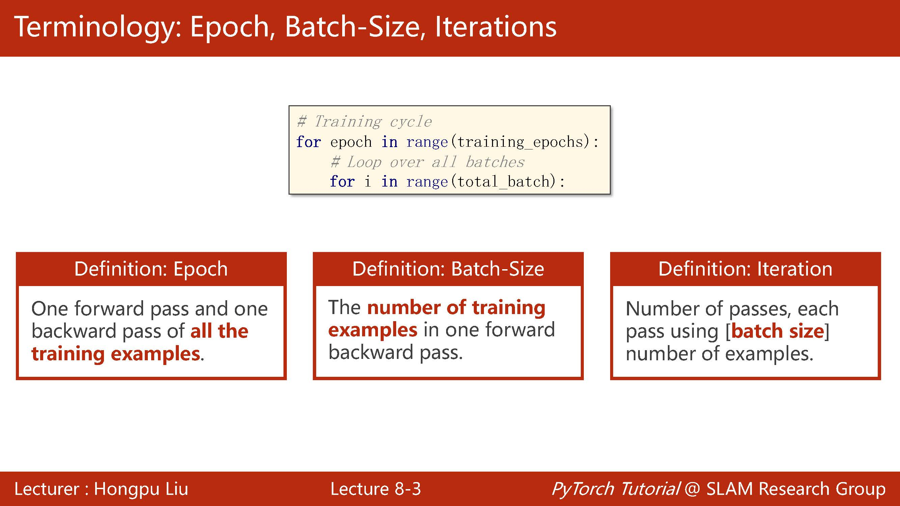
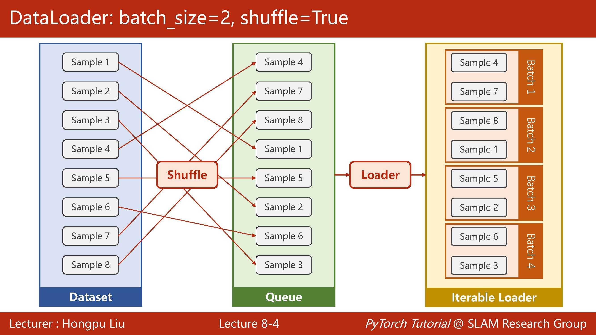
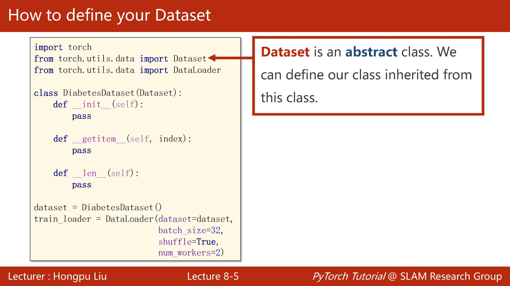
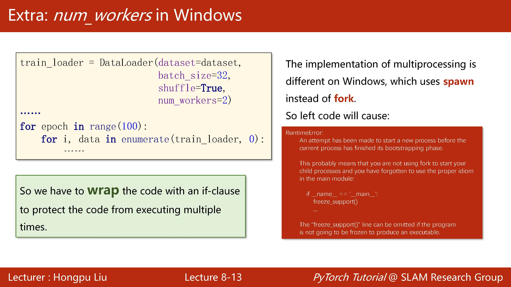
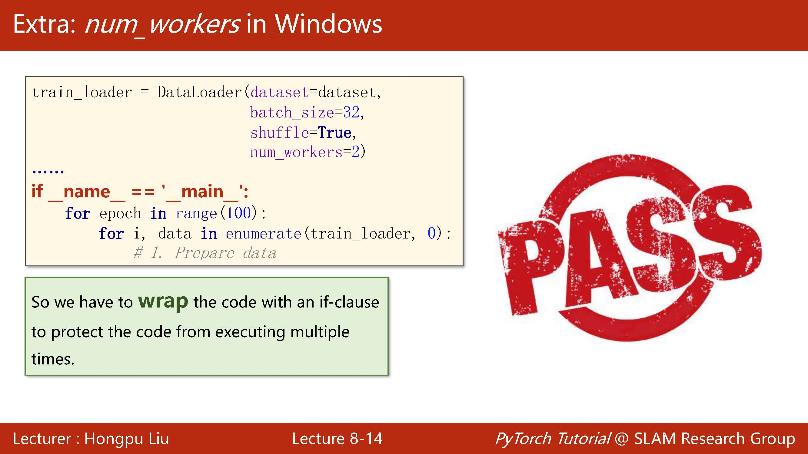
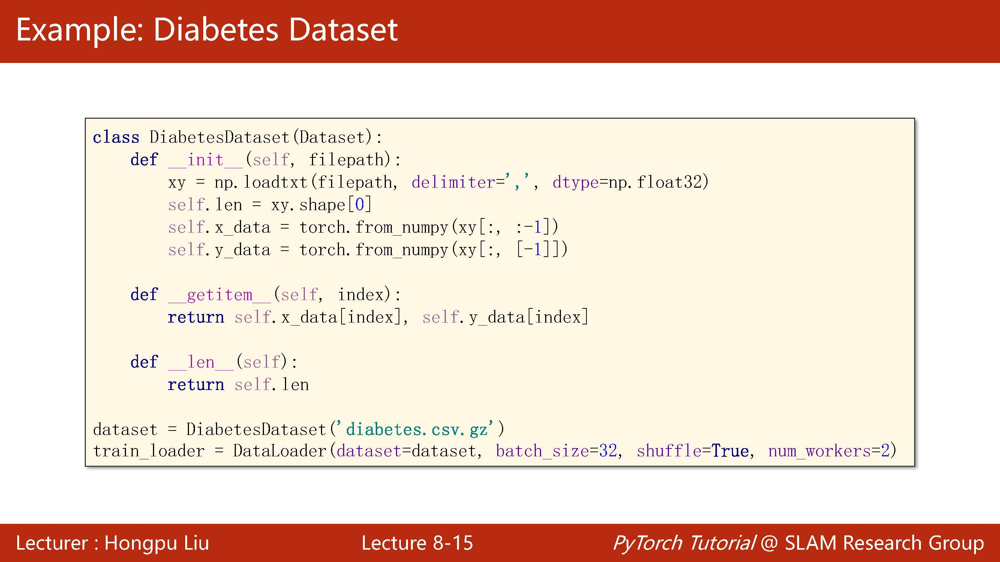
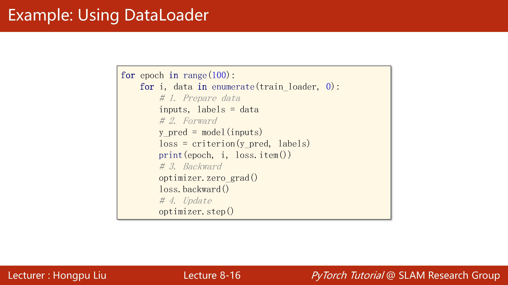
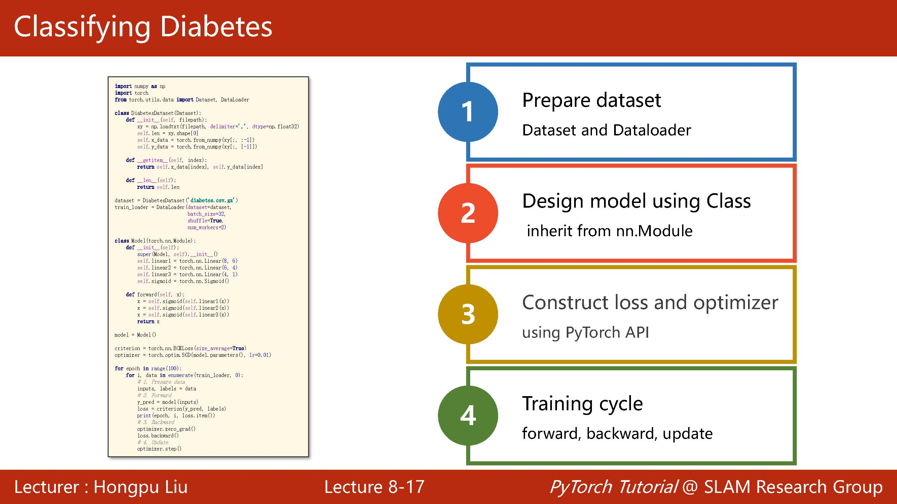

# 零基础学Pytorch#2 | 用Pytorch加载数据集

## Ⅰ.笔记目标

此博文就学习Pytorch具体实践做学习笔记，适用于对机器学习、深度学习有一定理论基础但实践能力薄弱的朋友。本文也着重讲解代码实践过程，不重概念的讲解。

课件与参考资料均来自：[B站"刘二大人"老师的视频](https://www.bilibili.com/video/BV1Y7411d7Ys)

*此账号与error13为同一拥有者，此博客为error13博文的补充与更新（增加源码和详细解说）。

------

## Ⅱ.代码实操

一般我们都是利用mini-batch来均衡时间上和性能上的最优，如果使用batch虽然能够利用好矩阵的计算优势，但每次更新权重都需要计算全部数据，时间上相对较慢，且存在可能卡在鞍点的情况；而mini-batch则可以通过超参数调试选择合适的batch size来快速训练。

以后每次写训练循环就需要写一个双重循环了，外面跑iteration次里面跑batch-size次。



下面再着重讲解Epoch和Batch-size概念，我们知道模型的一个完整训练流程为：

> 前向传播计算结果 -> 反向传播计算损失 -> 更新权重

那么我们就将模型将数据集的所有数据都计算上述过程叫为模型跑通了一个Epoch。

而因为机器性能又或是训练效果的原因。我们很少将所有数据集都前向传播反向传播计算后仅更新一次权重就完成Epoch，我们一般是通过很多个Iteration来实现所有数据经过模型的计算。

那么每次Iteration如果我们只传入一张图片前向传播、反向传播、更新，那么batch-size就是1；

如果每次Iteration我们传入N张图片，每张图片前向传播、反向转播后累加损失，等N张图片都计算完后再用累加的损失更新权重，那么batch-size就是N。

下面用图片来可视化dataloader的过程。



所以整个的流程是从dataset继承类并写好自己的dataset，其中需要重写的为getitem和len，然后将其实例化后送入dataloader中。

下面详细讲解下如何在python中实现，dataset是一个抽象类，无法实例化，只能被继承。

我们自己定义一个训练模型后直接继承自dataset即可，其中很重要的是**getitem**和**len**，前者是为了能够直接用下标索引的方法调取数据，后者是为了能够计算数据长度。

定义好类后就可以直接实例化了，dataloader一般使用的参数只有四个，其中的num_workers是线程数量。



```python
class OurDataset(Dataset):
    def __init__(self, filepath) -> None:
        xy = np.loadtxt(filepath, delimiter=',', dtype=np.float32)
        self.len = xy.shape[0]
        self.x_data = torch.from_numpy(xy[:, :-1])
        self.y_data = torch.from_numpy(xy[:, [-1]])
    
    def __getitem__(self, index) -> T_co:
        return self.x_data[index], self.y_data[index]
    
    def __len__(self):
        return self.len
    
dataset = OurDataset("file.csv.gz")
data_loader = DataLoader(
    dataset = dataset,
    batch_size = 32,
    shuffle = True,
    num_workers = 2
)
```

在window下还要特别注意，会报错，需添加一行红色的代码。





其余的地方都和逻辑回归问题类似，只不过这里我们不再把整个数据集加载进去了，而是以batch size 的大小加载训练更新一次参数。





```python
model = Model() 
criterion = torch.nn.BCELoss(size_average=True)
optimizer = torch.optim.SGD(model.parameters(), lr = 0.01)

for epoch in range(200):
    for i, data in enumerate(data_loader, start=0):
        input, labels = data
        output = model(input)
        loss = criterion(output,labels)
        optimizer.zero_grad()
        loss.backward()
        optimizer.step()
```



------

## Ⅲ.代码总览

```python
import torch
import numpy as np
from torch.utils.data import DataLoader, Dataset

class OurDataset(Dataset):
    def __init__(self, filepath) -> None:
        xy = np.loadtxt(filepath, delimiter=',', dtype=np.float32)
        self.len = xy.shape[0]
        self.x_data = torch.from_numpy(xy[:, :-1])
        self.y_data = torch.from_numpy(xy[:, [-1]])
    
    def __getitem__(self, index) -> T_co:
        return self.x_data[index], self.y_data[index]
    
    def __len__(self):
        return self.len
    
dataset = OurDataset("file.csv.gz")
data_loader = DataLoader(
    dataset = dataset,
    batch_size = 32,
    shuffle = True,
    num_workers = 2
)

class Model(torch.nn.Module):
    def __init__(self):
        super().__init__()
        self.linear1 = torch.nn.Linear(8,6)
        self.linear2 = torch.nn.Linear(6,4)
        self.linear3 = torch.nn.Linear(4,2)
        self.linear4 = torch.nn.Linear(2,1)
        self.sigmoid = torch.nn.Sigmoid()
        
    def forward(self,x):
        x = self.sigmoid(self.linear1(x))
        x = self.sigmoid(self.linear2(x))
        x = self.sigmoid(self.linear3(x))
        x = self.sigmoid(self.linear4(x))
        return x
    
model = Model() 
criterion = torch.nn.BCELoss(size_average=True)
optimizer = torch.optim.SGD(model.parameters(), lr = 0.01)

for epoch in range(200):
    for i, data in enumerate(data_loader, start=0):
        input, labels = data
        output = model(input)
        loss = criterion(output,labels)
        optimizer.zero_grad()
        loss.backward()
        optimizer.step()
```

