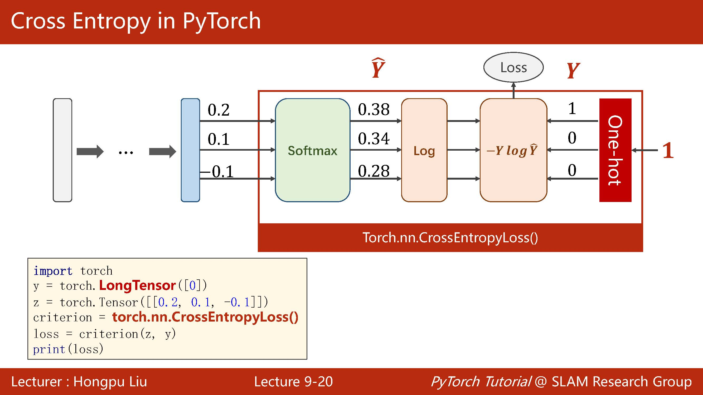

# 零基础学Pytorch#3 | 用Pytorch实现Softmax多分类

## Ⅰ.笔记目标

此博文就学习Pytorch具体实践做学习笔记，适用于对机器学习、深度学习有一定理论基础但实践能力薄弱的朋友。本文也着重讲解代码实践过程，不重概念的讲解。

课件与参考资料均来自：[B站"刘二大人"老师的视频](https://www.bilibili.com/video/BV1Y7411d7Ys)

*此账号与error13为同一拥有者，此博客为error13博文的补充与更新（增加源码和详细解说）。

------

## Ⅱ.代码实操

这节课老师主要讲是如何应用softmax实现多分类问题，具体为何要使用softmax可以观看老师的视频，此笔记依旧将重点放在如何实现层面而不是原理层面。


这里要注意区分NLLLoss和CrossEntropyLoss上面，CrossEntropyLoss包括了NLLLoss + log + softmax。

还要注意的是torch包装的CrossEntropyLoss已经包含的一个softmax函数，也就是说最后一层不用加激活层，直接送进CrossEntropyLoss就好啦



下面是用numpy实现NLLLoss，让我们更加直观理解NLLLoss的计算过程。

```python
y = np.array([1, 0, 0])
z = np.array([0.2, 0.1, -0.1])
y_pred = np.exp(z) / np.exp(z).sum()
loss = (-y * np.log(y_pred)).sum()
```


一般我们在处理图像时我们会先进行预处理，将0-255的像素值压到0-1的范围，这样的归一化更有利于函数的收敛。

PIL读取图像是RGB格式，这里的totensor就可以自动的将PIL转化为torch的tensor了。


然后还要进行一次归一化。


最后是整一个模型的预览，注意这里的view相当于reshape，而-1则代表自动计算，因为已经给出了总的大小和后一维度784，让框架自动根据每次输入数据的大小计算前一维度的维度数即可。

train和test部分和后面大同小异，只需要注意test部分我们是不需要计算梯度的。


------

## Ⅲ.代码总览

```python
import torch
from torchvision import transforms
from torchvision import datasets
from torch.utils.data import DataLoader
import torch.nn.functional as F
import torch.optim as optim
 
batch_size = 64
transform = transforms.Compose([transforms.ToTensor(), transforms.Normalize((0.1307,), (0.3081,))]) 
 
train_dataset = datasets.MNIST(root='../dataset/mnist/', train=True, download=True, transform=transform)
train_loader = DataLoader(train_dataset, shuffle=True, batch_size=batch_size)
test_dataset = datasets.MNIST(root='../dataset/mnist/', train=False, download=True, transform=transform)
test_loader = DataLoader(test_dataset, shuffle=False, batch_size=batch_size)
 
class Net(torch.nn.Module):
    def __init__(self):
        super(Net, self).__init__()
        self.l1 = torch.nn.Linear(784, 512)
        self.l2 = torch.nn.Linear(512, 256)
        self.l3 = torch.nn.Linear(256, 128)
        self.l4 = torch.nn.Linear(128, 64)
        self.l5 = torch.nn.Linear(64, 10)
 
    def forward(self, x):
        x = x.view(-1, 784)  
        x = F.relu(self.l1(x))
        x = F.relu(self.l2(x))
        x = F.relu(self.l3(x))
        x = F.relu(self.l4(x))
        return self.l5(x)  #最后一层不需要relu激活函数
 
 
model = Net()
 
criterion = torch.nn.CrossEntropyLoss()
optimizer = optim.SGD(model.parameters(), lr=0.01, momentum=0.5)
 
def train(epoch):
    running_loss = 0.0
    for batch_idx, data in enumerate(train_loader, 0):
        inputs, target = data
        optimizer.zero_grad()
        outputs = model(inputs)
        loss = criterion(outputs, target)
        loss.backward()
        optimizer.step()
 
        running_loss += loss.item()
        if batch_idx % 300 == 299:
            print('[%d, %5d] loss: %.3f' % (epoch+1, batch_idx+1, running_loss/300))
            running_loss = 0.0
 
 
def test():
    correct = 0
    total = 0
    with torch.no_grad():
        for data in test_loader:
            images, labels = data
            outputs = model(images)
            _, predicted = torch.max(outputs.data, dim=1) 
            total += labels.size(0)
            correct += (predicted == labels).sum().item() 
    print('accuracy on test set: %d %% ' % (100*correct/total))
 
 
if __name__ == '__main__':
    for epoch in range(10):
        train(epoch)
        test()
```

