# 零基础学Pytorch#1 | 用Pytorch实现线性回归

## Ⅰ.笔记目标

此博文就学习Pytorch具体实践做学习笔记，适用于对机器学习、深度学习有一定理论基础但实践能力薄弱的朋友。本文也着重讲解代码实践过程，不重概念的讲解。

课件与参考资料均来自：[B站"刘二大人"老师的视频](https://www.bilibili.com/video/BV1Y7411d7Ys)

*此账号与error13为同一拥有者，此博客为error13博文的补充与更新（增加源码和详细解说）。

------

## Ⅱ.代码实操

在之前的几课中，老师手写了一个简单的线性回归，也使用了backward自动计算反向传播，注意的是最后要手动清零梯度。

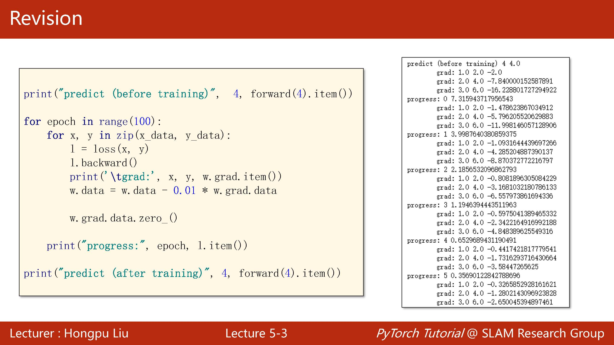

但这样子手写代码简单点的模型还可以自己写，如果后面遇到难度大的模型呢？

于是这一讲主要就集中在如何使用Pytorch的框架来实现线性回归。

接下来老师介绍了一般用pytorch实践的基本流程，**首先**是要准备好处理好自己的数据，**然后**设计计算模型（目的是为了计算yhat），**第三步**是利用pytorch的API接口构造损失函数和优化器，**最后**就是写训练周期了（简单点说就是前馈——反馈——更新循环）

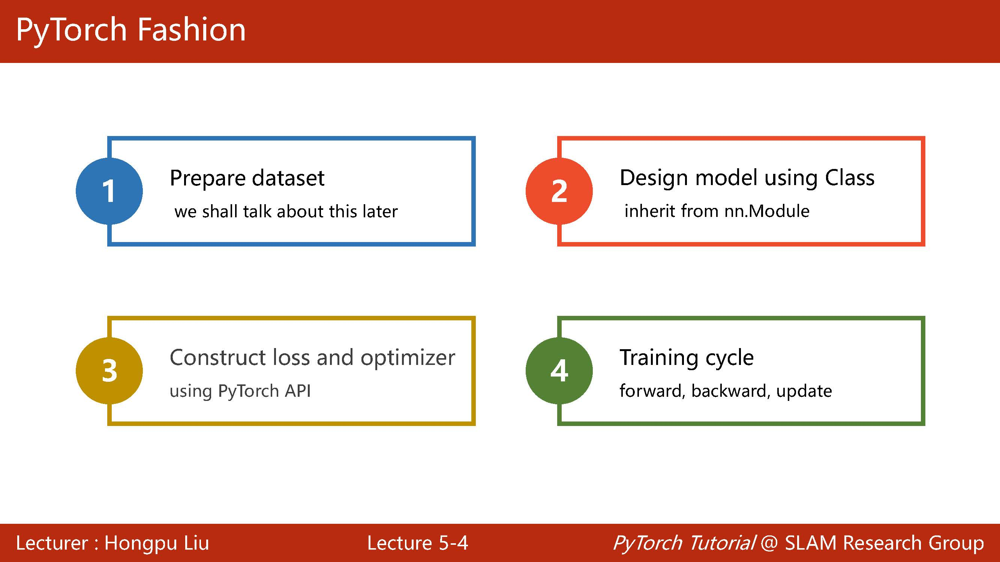

### 一、准备数据

因为只是简单的展示学习，所以这里直接用最简单的数据即可，最终目标由肉眼可得希望结果为2，实现线性回归。

```python
x_data = torch.Tensor([[1.0],[2.0],[3.0]])
y_data = torch.Tensor([[2.0],[4.0],[6.0]])
```

### 二、设计模型

下面就是一个简单的示例，将模型定义为一个类（在后面构造复杂的CNN或RNN都是将其定义为类似如图的类，然后再以此为基础进行扩展），然后都是继承自Module。

最少需要两个函数即init和forward（理解为overwrite），可能你会问为什么不需要backward，因为你用module构造模型会自动帮你计算反馈，所以就不用自己写啦。

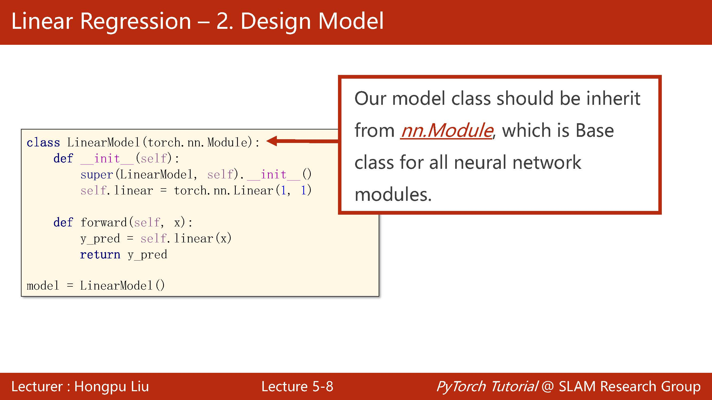

```python
class LinearModel(torch.nn.Module):
    def __init__(self):
        super().__init__()
        self.linear = torch.nn.Linear(1,1)
        
    def forward(self, x):
        y_pred = self.linear(x)
        return y_pred
    
model = LinearModel()
```

super直接调用父类的初始化，just do it， 一定要有的

然后的linear就是核心计算部分了，注意此处调用了pytorch接口torch.nn.Linear，详情参数看下图，这里的in_features和out_features是一样的，这里只用输入features大小，不用输入数据的多少，下面对其参数做简单解释。

> (in_features: int, out_features: int, bias: bool = True) -> None

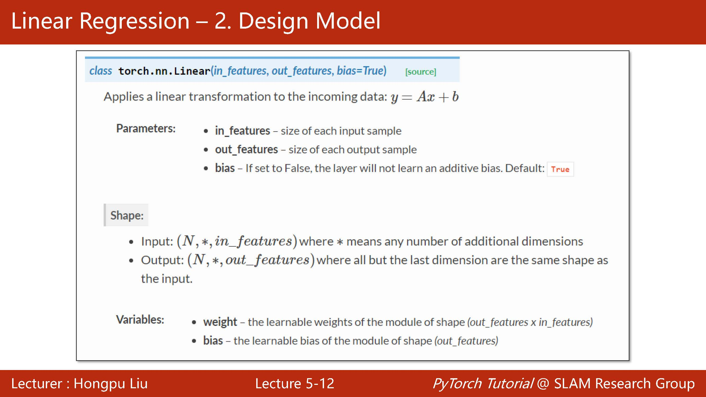

在forward函数里面直接在linear后面写了（x）证明这是一个可调用的函数

之后如果要使用这个定义好的类直接实例化就好了，由于是可调用，故后面括号直接写上x就行了，即model（x）

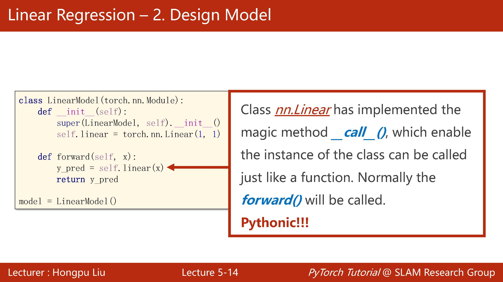

### 三、构造损失函数和优化器

然后是构造损失函数和优化器，pytorch有很多自带的可以选择

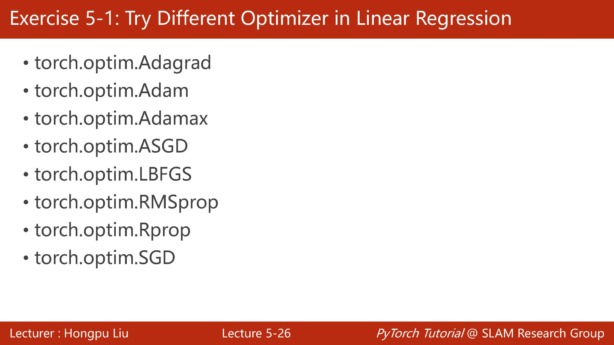

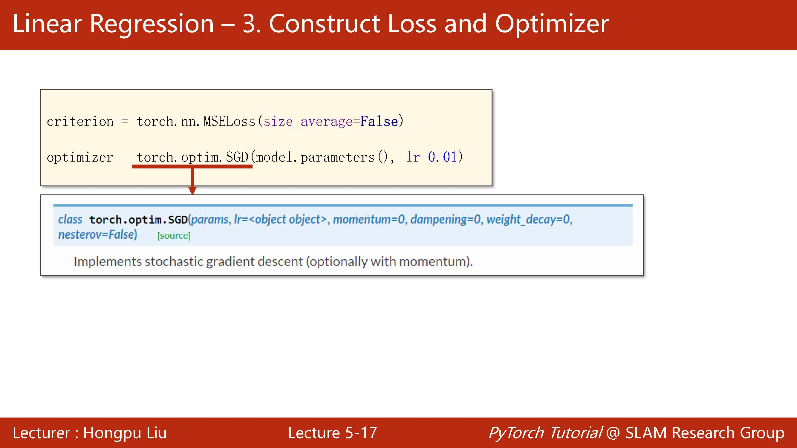

这里我们选用MSELoss和SGD优化器，具体选择要根据不同需求选取，否则很可能会事倍功半，适得其反。

```python
criterion = torch.nn.MSELoss(size_average=False)
optimizer = torch.optim.SGD(model.parameters(), lr=0.01)
```

这里我们要告诉优化器哪些参数是需要优化的，故直接用model.parameters（其实是调用父类的parameters），不管模型有多么复杂都能帮你把可训练的参数自动找出来。

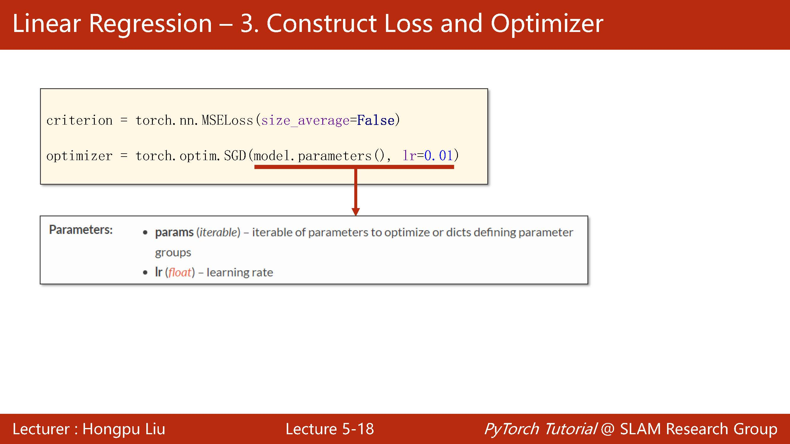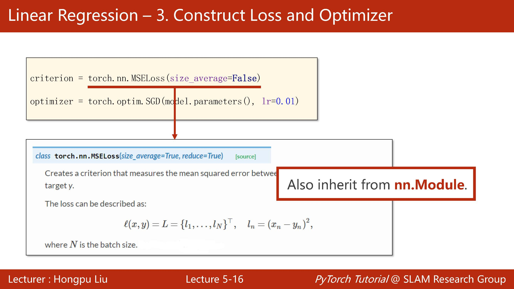

### 四、训练循环

最后就是训练的过程，同样在计算过程中要特别小心需要手动梯度归零。

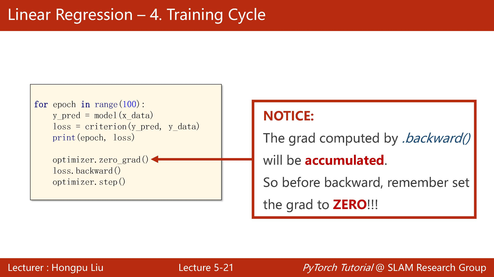

```python
for epoch in range(10):
    y_pred = model(x_data)
    loss = criterion(y_pred, y_data)
    print(epoch, loss)
    
    optimizer.zero_grad()
    loss.backward()
    optimizer.step()
```

特别注意若没有optimizer.zero_grad()梯度清零会导致每次的损失持续累加，优化效果差。

最后打印出来的时候记得要加.item，不然打印出来的是会是一个[[ ]]的矩阵，而我们只需要它的值。

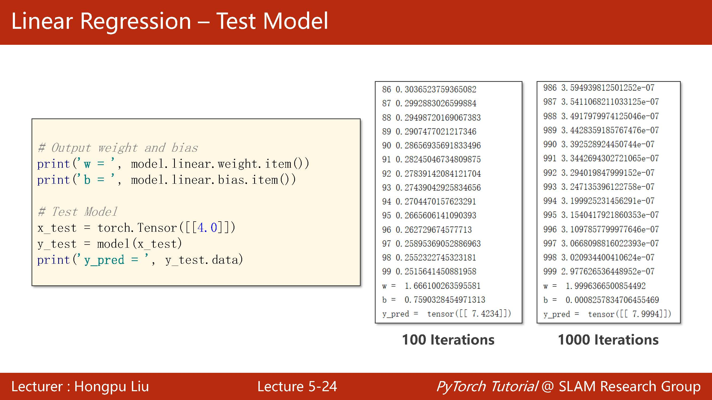

最后来一个大总结，总的来说还是这四部，准备数据集，构造模型，选择损失函数和优化器最后进行循环。前三部都是为了最后循环做准备的。

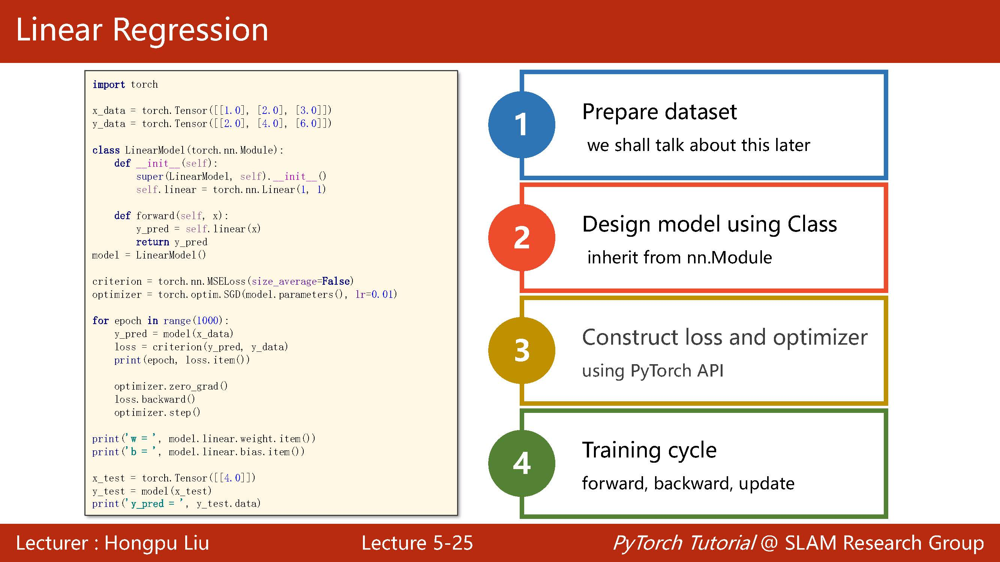

------

## Ⅲ.代码总览

```python
import torch

x_data = torch.Tensor([[1.0],[2.0],[3.0]])
y_data = torch.Tensor([[2.0],[4.0],[6.0]])

class LinearModel(torch.nn.Module):
    def __init__(self):
        super().__init__()
        self.linear = torch.nn.Linear(1,1)
        
    def forward(self, x):
        y_pred = self.linear(x)
        return y_pred
    
model = LinearModel()

criterion = torch.nn.MSELoss(size_average=False)
optimizer = torch.optim.SGD(model.parameters(), lr=0.01)

for epoch in range(10):
    y_pred = model(x_data)
    loss = criterion(y_pred, y_data)
    print(epoch, loss)
    
    optimizer.zero_grad()
    loss.backward()
    optimizer.step()
    
print('w = ', model.linear.weight.item())
print('b = ', model.linear.bias.item())

x_test = torch.Tensor([[4.0]])
y_test = model(x_test)
print("y_pred = ", y_test.data)
```

